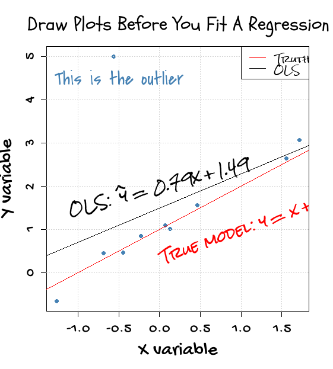
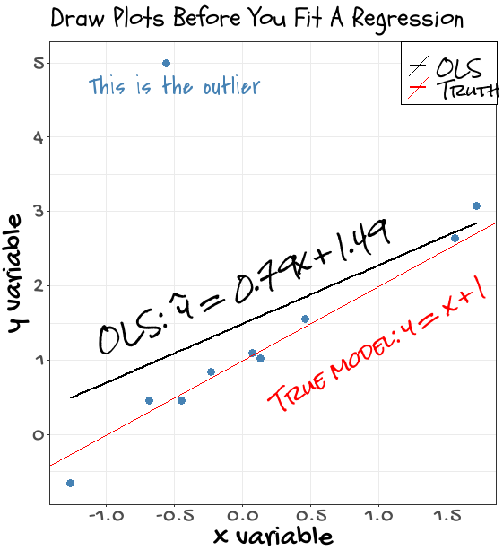

# Ensayo para probar la librería `showtext`en R
Este repositorio es la síntesis de una serie de posts publicados en RStudio Community. El objetivo fue recrear en `ggplot2` el gráfico de presentación de la librería `showtext`, que utiliza las funciones gráficas básicas de R. El gráfico original puede verse en el [repositorio](https://github.com/yixuan/showtext) de su autor, [Yixuan Qiu](https://github.com/yixuan)
El resultado se presenta en el archivo R 'ggplot2_showtext.R' incluido en este repositorio. Las soluciones encontradas posiblemente no sean las óptimas, y pueda haber otras más sencillas. 

### Gráfico original de [Yixuan Qiu](https://github.com/yixuan)

### Mi versión en `ggplot2`

